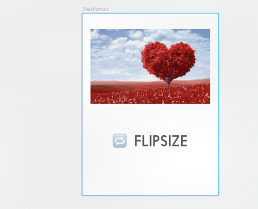

# 🔁 FlipSize

  

FlipSize is a small Sketch plugin which swaps the width and height of an artboard, layer or shape.

## 👈 Usage

Download the `FlipSize.sketchplugin` file and double click or place in your `Plugins` folder.

## 🔠 Shortcuts

CMD + Shift + Y
